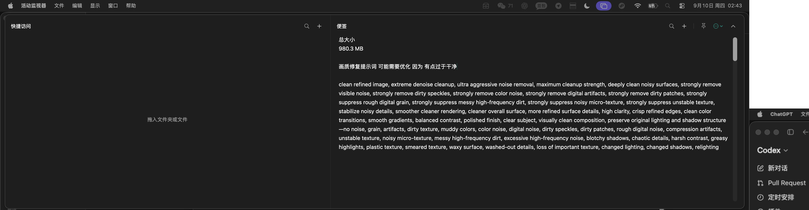

# 拾屉 · TopShelf

原生 macOS 快捷访问与便签工具。Swift / SwiftUI / AppKit 实现，无第三方依赖，无联网功能，不读取剪贴板。

从屏幕顶部滑出，记下便签，或一键打开常用文件夹和文件。支持 macOS 13+，已在 Apple Silicon 上验证；Intel Mac 尚未实机验证。

本项目使用 [MIT 许可证](LICENSE)。这是独立开发的应用，与 Unclutter 没有关联。



## 从源码安装

安装 Xcode 或 Xcode Command Line Tools 后，在终端运行：

```sh
git clone https://github.com/490003183-glitch/shiti.git
cd shiti
swift test
bash scripts/build.sh
```

退出已运行的拾屉，再将 `dist/拾屉.zip` 解压，把 `拾屉.app` 放入 `~/Applications/` 后打开。构建脚本只在本地编译和临时签名，无需付费开发者账号；当前没有经过 Developer ID 签名及公证的公开安装包。

## 当前版本 0.3.5

便签标题只读取首个非空行的前 70 个字符，避免拆分整篇长便签；编辑绑定仅捕获便签 ID，避免额外持有历史文本。保留原有编辑器、撤销和光标状态。这是临时分配的精简，不承诺固定的常驻内存降幅。

收起动画结束后，编辑界面暂时脱离窗口，并释放应用菜单；展开时恢复同一个编辑界面，避免丢失光标和撤销状态。全局呼出快捷键和菜单栏入口保持可用。

滑动使用 Core Animation 图层位移，编辑区布局不随每帧移动；没有 60 Hz 动画定时器。

仅在便签或快捷入口有变化时保存，收起面板和退出仍会立即保存未写入的修改。关闭顶部呼出会撤掉滚动与拖动监听；面板收起后只保留所启用功能必需的事件监听。

抽屉默认展开到当前屏幕可用宽度的两侧各留 12 点；快捷访问区和便签区随宽度调整。搜索按需展开，导出、删除等操作放在更多菜单。

左栏是带文件夹名或文件名的**快捷按钮**。它保存目标引用，不复制、移动、上传或删除原文件。

- 点 `+` 选择文件夹或文件，也可以拖入左栏添加按钮。
- 单击文件夹按钮，在 Finder 中打开；单击文件按钮，使用默认应用打开原文件。
- 按钮显示目标图标和名称；悬停查看完整路径，搜索框按名称查找。
- 同一目标重复添加只保留一个入口；不同目录下的同名文件可分别添加。
- 右键按钮，可在 Finder 中显示、重新选择目标，或移除快捷按钮。
- 移除按钮只改本应用的入口列表，原文件和文件夹不受影响。
- 使用 macOS 书签保存目标引用，可跟踪部分重命名或移动。目标不可用、磁盘断开或书签无法定位时会提示，可重新选择目标。

便签保留多条记录、全文搜索、自动保存与文本导出；删除便签前确认，内容以文本文件保留在系统废纸篓。

## 打开与呼出

本机应用安装位置：`~/Applications/拾屉.app`。双击打开后常驻菜单栏，不显示 Dock 图标。

- 鼠标移到屏幕最上沿，触控板两指向下滑，或鼠标滚轮向下滚，抽屉从顶部滑出。
- 未固定时，在屏幕最上沿反向滚动可收回；点击外部、Esc、收起按钮也会播放收回动画。
- 更多菜单可关闭顶部下拉，或反转顶部滚动方向以适配第三方鼠标驱动。
- 右上角更多菜单的“登录后自动启动”可自行开关，使用 macOS 登录项机制，首次安装不自动开启。若系统要求批准，菜单会显示前往系统设置的入口；返回应用时刷新状态。
- 点击菜单栏抽屉图标，或按 **Control + Option + 空格**，也可展开 / 收起。
- 仅屏幕最上沿 5 点区域响应顶部滚动，普通页面滚动与惯性滚动不会触发。
- 动画限制在当前显示器内；遵从系统“减少动态效果”设置。
- 图钉可保持面板打开；未固定时，点击其他应用收起。
- **Esc** 或 **⌘W** 收起；**⌘Q** 退出。
- **⌘O** 添加快捷访问；**⌘N** 新建便签。

独立面板拖出、自定义存储目录等尚未实现。

## 数据与备份

数据目录：`~/Library/Application Support/TopShelf/`

- `shelf.json`：快捷入口的路径和 macOS 书签、便签内容。

可以从右上角更多菜单打开此目录。退出应用后完整复制此目录即可备份。数据无法解码时暂停写入，保护已有内容。

便签以明文保存在本机，应用自身不提供加密。不要将个人 `shelf.json`、真实便签截图或文件访问书签上传到仓库或 Issue。

自动保存会原子替换同一个 `shelf.json`，不逐次生成历史副本；快捷访问仅保存引用，不缓存目标文件。磁盘占用主要随保留的便签内容与快捷入口数量增长。删除的非空便签保留在系统废纸篓，清空废纸篓后释放空间。删除失败时暂存的文本仍保留以免丢失。

不含云同步、剪贴板历史或 Unclutter 数据自动迁移。

## 编译

需要 Xcode 或 Swift 开发工具，macOS 13+。

```sh
swift test
bash scripts/build.sh
```

生成 `dist/拾屉.zip`，仅保留一份安装包。构建脚本在临时目录完成签名和校验，再打包，避免云同步目录自动附加的 Finder 元数据干扰签名。安装时退出旧版，将 ZIP 解压到本机应用目录。

当前脚本为本机架构构建并做临时签名。向其他电脑分发前，需要另行完成目标架构构建、Developer ID 签名和公证。

## App Store 准备中

`TopShelf.xcodeproj` 是实验性的商店构建目标，启用 `APP_STORE` 条件编译、安全作用域书签和沙盒。`AppStore/` 包含权限、隐私清单与预览配置，其中名称与 Bundle ID 仍为草稿。正式签名、沙盒实机回归、商店资料与审核尚未完成，不能直接发布到 App Store。开源版本没有购买或试用限制。

商店沙盒版使用系统分配的容器保存数据，不会自动读取或迁移现有本地版便签。签名后须在独立测试容器验证文件授权在重启后仍有效。测试截图只用示例数据。

## 参与改进

欢迎提交 [Issue](https://github.com/490003183-glitch/shiti/issues) 或 Pull Request。反馈问题时请附上应用版本、macOS 版本、芯片型号及复现步骤，并使用模拟便签。提交代码前运行 `swift test`；界面与手势改动请在 Mac 上验证展开、收起和编辑保存。
